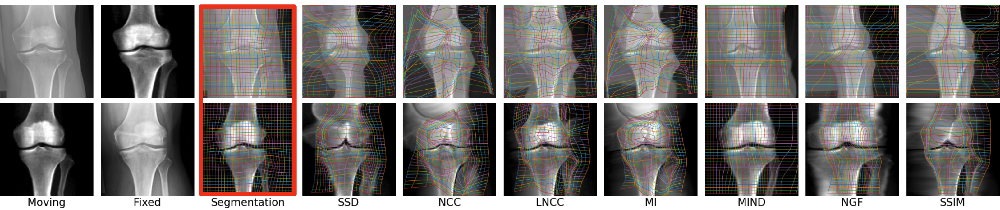

# Multimodal Image Registration Guided by Few Segmentations from One Modality

This is the official repository for  

**Multimodal Image Registration Guided by Few Segmentations from One Modality**   
Basar Demir, Marc Niethammer.  
_MIDL 2024_ [OpenReview](https://openreview.net/forum?id=cRmz96uGD6)

## Environment
To install the required packages, run the following commands in the terminal:

```
git clone https://github.com/uncbiag/SegGuidedMMReg.git
cd SegGuidedMMReg

pip install -r requirements.txt
```

## Data
The data used in the paper is not publicly available. However, the code can be run with any multimodal image registration dataset. The data should be organized as follows:

```
<project_root>__data
                |___source_dataset.pt
                |___source_dataset_seg.pt
                |___source_dataset_wo_seg.pt
                |___target_dataset.pt
                |___target_dataset_seg.pt
                |___target_dataset_wo_seg.pt
```
The data should be in the form of PyTorch tensors. The `source_dataset.pt` and `target_dataset.pt` files should contain the source and target images; the `source_dataset_seg.pt` and `target_dataset_seg.pt` files should contain the segmentations of the source and target images; the `source_dataset_wo_seg.pt` and `target_dataset_wo_seg.pt` files should contain the images without segmentations. Training does not require the segmentations of the target images. All of the image tensors should be in the shape of `(N, C, H, W)`, where `N` is the number of images, `C` is the number of channels, and `H` and `W` are the height and width of the images, respectively. The segmentation tensors should be in the shape of `(N, 1, H, W)`.

## Training
To train the model, first set `CHANNELS` and `SEG_CLASSES` in the `train.sh` file according to the number of channels and segmentation classes in the data. Then, run the following command in the terminal:

```
bash train.sh
```

This code will train the whole approach: registration network for augmentation (registration-augmentation.py), source segmentation network (segment-w-augmentation.py), domain adaptation network (domain-adaptation.py), and registration network (registration-segmentation.py). The trained models will be saved in the `results` directory.

## Evaluation
The `test.ipynb` notebook can be used to evaluate the trained models. The notebook will load the trained models, and evaluate and visualize them on the test set.

## Citation
```
@inproceedings{demir2024multimodal,
  title={Multimodal Image Registration Guided by Few Segmentations from One Modality},
  author={Demir, Basar and Niethammer, Marc},
  booktitle={Medical Imaging with Deep Learning},
  year={2024}
}
```

## Acknowledgements
Our project is based on the [ICON](https://github.com/uncbiag/ICON) and [pytorch-CycleGAN-and-pix2pix](https://github.com/junyanz/pytorch-CycleGAN-and-pix2pix) repositories. We thank the authors for their work.